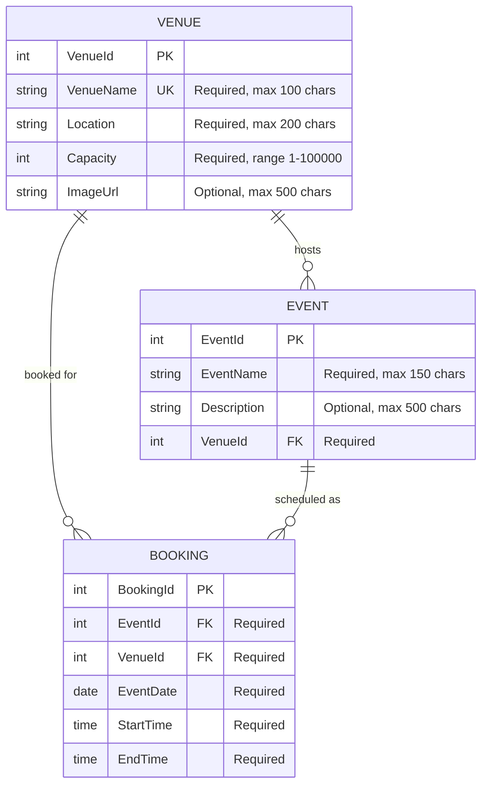

# EventEase — Entity Relationship Diagram

## Diagram

## Entities

### Venue

| Field     | Type     | Constraints                  | Description                        |
|-----------|----------|------------------------------|------------------------------------|
| VenueId   | int      | PK, auto-increment           | Unique venue identifier            |
| VenueName | string   | Required, max 100, Unique    | Name of the venue                  |
| Location  | string   | Required, max 200            | Physical address or area           |
| Capacity  | int      | Required, range 1–100,000    | Maximum number of attendees        |
| ImageUrl  | string?  | Optional, max 500            | Path to venue image or external URL|

### Event

| Field       | Type     | Constraints        | Description                     |
|-------------|----------|--------------------|---------------------------------|
| EventId     | int      | PK, auto-increment | Unique event identifier         |
| EventName   | string   | Required, max 150  | Name of the event               |
| Description | string?  | Optional, max 500  | Details about the event         |
| VenueId     | int      | FK → Venue, Required | Venue where the event is held |

### Booking

| Field     | Type     | Constraints            | Description                          |
|-----------|----------|------------------------|--------------------------------------|
| BookingId | int      | PK, auto-increment     | Unique booking identifier            |
| EventId   | int      | FK → Event, Required   | Event being booked                   |
| VenueId   | int      | FK → Venue, Required   | Venue being booked                   |
| EventDate | DateTime | Required               | Date of the booking                  |
| StartTime | TimeSpan | Required               | Start time of the booking            |
| EndTime   | TimeSpan | Required               | End time of the booking              |

## Relationships

| Relationship      | Cardinality | FK Column | Delete Behavior |
|-------------------|-------------|-----------|-----------------|
| Venue → Event     | One-to-Many | Event.VenueId   | Restrict |
| Venue → Booking   | One-to-Many | Booking.VenueId | Restrict |
| Event → Booking   | One-to-Many | Booking.EventId | Restrict |

**Delete Behavior: Restrict** — A venue cannot be deleted if it has associated events or bookings. An event cannot be deleted if it has associated bookings. This is enforced at both the database (FK constraint) and application (controller) level.

## Business Rules

1. **Double-booking prevention**: A booking cannot be created if another booking exists for the same venue on the same date with overlapping time (StartTime < other.EndTime AND EndTime > other.StartTime).
2. **Venue deletion restriction**: Venues with associated events or bookings cannot be deleted.
3. **Event deletion restriction**: Events with associated bookings cannot be deleted.
4. **Venue name uniqueness**: A unique index enforces that no two venues can share the same name.

## Seed Data

The database is seeded with initial data for development and testing:

- **3 Venues**: Grand Ballroom (Cape Town, 500), Skyline Terrace (Johannesburg, 200), The Garden Pavilion (Durban, 150)
- **2 Events**: Annual Gala (Grand Ballroom), Tech Conference 2026 (Skyline Terrace)
- **1 Booking**: Annual Gala on 2026-06-15, 18:00–23:00
